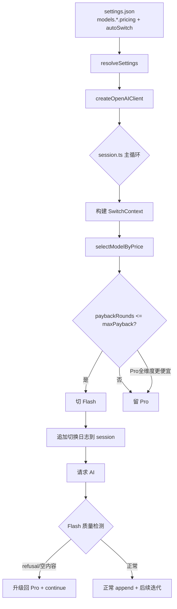

## 产品概述

为 deepseek-code-cli 实现基于真实 API 价格的模型自动切换策略（Pro/Flash），在编程能力不变的前提下最小化 API 花费。核心约束：Pro 和 Flash 前缀缓存物理隔离，切换触发 cache miss。

## 核心功能

- P0: 价格感知切换 -- 回本轮数法决策是否从 Pro 切到 Flash
- P1: maxPaybackRounds 和 estimatedOutputPerRound 可配置（settings.json autoSwitch 段）
- P2: Flash 质量不足时自动升级到 Pro（pre-append 检测 refusal/空内容）
- P3: AskUserQuestion 工具调用后锁定不切 Flash
- P4: 计算结果的 UI 展示（切换原因、回本轮数）

## 技术栈

- TypeScript + Node.js（现有项目）
- 测试框架：node:test + assert

## 实现方案

### 核心算法：回本轮数法

```
switchPenalty = accumulatedTokens/1M * (flash.cacheMiss - pro.cacheHit)
roundSaving   = outputEst/1M * (pro.output - flash.output)
paybackRounds = switchPenalty / roundSaving  (roundSaving > 0)

paybackRounds <= maxPaybackRounds (默认 8) -> 切 Flash
否则 -> 留 Pro
```

当 Pro 三个维度（cacheHit/cacheMiss/output）都不比 Flash 贵时，永不切换（当前 2.5 折自动命中此分支）。

### 数据流

```
settings.json autoSwitch 配置
  -> resolveSettings 解析为 ResolvedAutoSwitchConfig
  -> createOpenAIClient 返回值新增 pricing 字段
  -> session.ts 主循环中构建 SwitchContext（proPricing/flashPricing/accumulatedTokens/lastToolName）
  -> selectModelByPrice 数学决策
  -> 生成切换日志（含回本轮数）作为 hidden system message
```

### P2 实现方式：pre-append 检测

在 session.ts:971-982 之间（收集响应后、append 前），检测 Flash 的 refusal 或空内容，若质量不足则切换到 Pro 并 `continue`（不消耗 iteration），避免回滚复杂性。

## 实现注意事项

- pricing 数据通过 `createOpenAIClient(overrideModel)` 获取（它内部调用 `resolveSettings` 并支持 per-model pricing），无需额外读取 settings.json
- `accumulatedTokens` 使用 `getTotalTokens(responseUsage)`（最新一轮的 total_tokens，已包含在 session.activeTokens 中）
- 保留 `selectModelForIteration` 函数签名不变作为 fallback，新增 `selectModelByPrice` 函数
- AskUserQuestion 检测通过检查最后一批 toolCalls 的 function.name 实现
- 切换日志使用 `meta.asThinking = true` 标记为隐藏信息，不影响 visible token

## 架构设计



## 目录结构

```
src/
├── model-capabilities.ts  # [MODIFY] 新增 PricingSnapshot、SwitchContext、selectModelByPrice
├── settings.ts            # [MODIFY] 新增 AutoSwitchConfig 类型、resolveAutoSwitchConfig 函数
├── session.ts             # [MODIFY] 集成价格感知切换 + Flash 质量检测 + AskUserQuestion 感知
├── ui/App.tsx             # [MODIFY] createOpenAIClient 返回值新增 pricing
└── tests/
    ├── model-capabilities.test.ts  # [NEW] selectModelByPrice 单元测试
    └── settings-and-notify.test.ts # [MODIFY] 新增 autoSwitch 配置解析测试
```